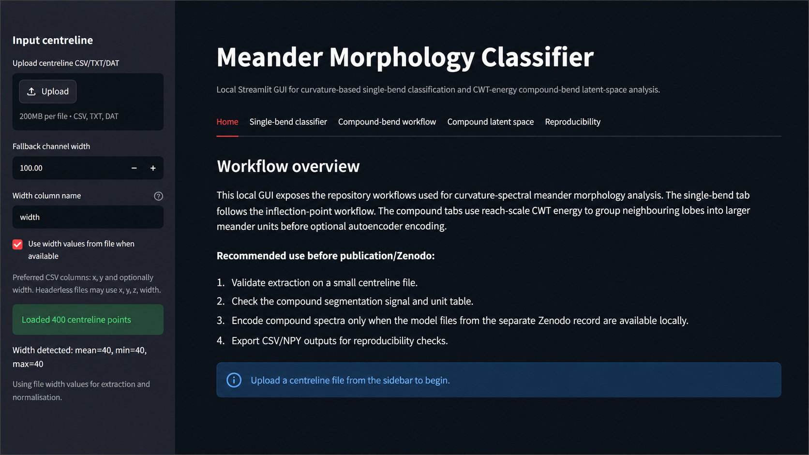
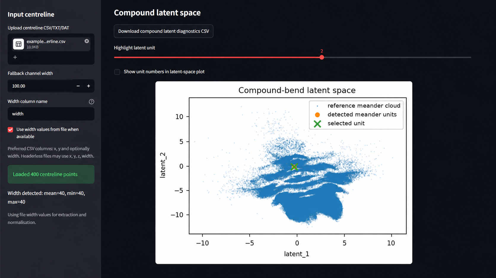

# Meander Morphology Classifier

[](https://github.com/sergioald/meander-morphology-classifier/actions/workflows/tests.yml)
[](./pyproject.toml)
[](./LICENSE)
[](https://doi.org/10.5281/zenodo.21134675)
[](https://doi.org/10.1029/2024WR037583)

Local research software for **curvature-based meander morphology analysis**, combining:

- **single-bend extraction and classification** from centreline geometry;
- **compound-bend segmentation** using reach-scale CWT energy;
- **latent-space visualisation** with archived autoencoder models;
- a **local Streamlit GUI** for reproducible exploration and export.

This repository accompanies the paper:

> **Lopez Dubon, S., Sgarabotto, A., & Lanzoni, S.**  
> *A data-driven approach to discern the curvature spectral complexity of compound meander bends.*  
> Water Resources Research. https://doi.org/10.1029/2024WR037583

---

## Overview

The repository provides two linked workflows:

1. **Single-bend classifier**  
   Extracts individual bends from a centreline using inflection-point logic and supports optional clustering in the latent space of the archived **single-bend autoencoder**.

2. **Compound-bend workflow**  
   Uses **reach-scale CWT energy** to group neighbouring lobes into larger compound meander units, export 64×64 spectra, and optionally encode them with the archived **compound autoencoder**.

The GUI exposes both workflows locally and allows users to:

- upload centreline files;
- use width values from file or a fallback width;
- inspect extraction and segmentation diagnostics;
- download CSV/NPY outputs;
- optionally load external archived model files from Zenodo.

---

## Software implementation

This repository is a cleaned, reusable research-software implementation of the meander-bend classification workflows associated with the archived software, model records and peer-reviewed article.

The implementation includes:

- packaging research scripts into reusable Python modules;
- command-line workflows for bend extraction, CWT-spectrum generation, classification and compound-bend encoding;
- integration of autoencoder-based latent-space workflows with Zenodo-hosted model artefacts;
- a local Streamlit GUI for interactive exploration and classification;
- separation between reusable methods, generated outputs, local model files and paper-production scripts;
- documentation for installation, model-file handling, reproducibility boundaries and citation requirements;
- lightweight tests and development checks suitable for public research-software use.

Large research datasets, generated spectra and trained model files are intentionally not committed to GitHub. They are handled through separate Zenodo records and local `models/` workflows.

---

## Visual overview

### GUI home / workflow overview

<p align="center">
  
</p>

### Compound latent-space view

<p align="center">
  
</p>

---

## Related archived records

### Software archive

- **Zenodo software DOI:** https://doi.org/10.5281/zenodo.21134675

### Single-bend model archive

- **Zenodo DOI:** https://doi.org/10.5281/zenodo.13913710
- Archived file used by the GUI/CLI: `Autoencoder_Meander_Bend.h5`

### Compound model + latent cloud archive

- **Zenodo DOI:** https://doi.org/10.5281/zenodo.20845480
- Typical local files used by the GUI/CLI:
  - `compound_autoencoder.h5`
  - `encoder_only.keras`
  - `encoder_only.h5`
  - `world_latent_cloud.npy`

> The software repository is archived separately from trained model files. Model files should remain local and are intentionally not tracked by Git.

---

## Installation

### 1) Clone the repository

```bash
git clone https://github.com/sergioald/meander-morphology-classifier.git
cd meander-morphology-classifier
```

### 2) Create and activate an environment

Using Anaconda:

```bash
conda create -n meander-morphology python=3.11 -y
conda activate meander-morphology
```

### 3) Install the package

```bash
python -m pip install --upgrade pip
python -m pip install -e ".[dev]"
```

For GUI use:

```bash
python -m pip install -e ".[gui,deep-learning]"
```

For model inference without the GUI:

```bash
python -m pip install -e ".[deep-learning]"
```

---

## Launch the local GUI

```bash
streamlit run app/streamlit_app.py
```

Then open the local address shown in the terminal, typically:

```text
http://localhost:8501
```

### Recommended GUI workflow

1. Upload a small centreline file.
2. Confirm detected width values or set a fallback width.
3. Inspect **single-bend** or **compound-bend** outputs.
4. Load Zenodo model files only when latent encoding is required.
5. Export CSV/NPY outputs for reproducibility checks.

---

## Input format

Preferred centreline file columns:

- `x`, `y`;
- optionally `width`.

Headerless files may also be used, depending on the workflow settings. The GUI supports CSV/TXT/DAT centreline inputs.

---

## Command-line workflows

### Quick single-bend demo

```bash
python scripts/extract_single_bends.py \
  --input examples/example_centerline.csv \
  --output outputs/example_bends \
  --width-column width
```

### Single-bend classification using the Zenodo autoencoder

```bash
python scripts/download_model.py --output models/

python scripts/classify_single_bends.py \
  --spectra outputs/example_bends/spectra.npy \
  --model models/Autoencoder_Meander_Bend.h5 \
  --output outputs/example_classification
```

### Compound-bend extraction

```bash
python scripts/extract_compound_bends.py \
  --input examples/example_centerline.csv \
  --output outputs/example_compound_bends \
  --width-column width
```

Expected outputs include:

- `compound_bend_summary.csv`;
- `compound_spectra.npy`;
- `compound_spectra/` preview images;
- `diagnostics/compound_segmentation_signal.csv`.

### Compound latent encoding

```bash
python scripts/encode_compound_bends.py \
  --spectra outputs/example_compound_bends/compound_spectra.npy \
  --summary outputs/example_compound_bends/compound_bend_summary.csv \
  --model models/compound_autoencoder.h5 \
  --output outputs/example_compound_bends/encoded \
  --latent-layer-name Latent_Space \
  --background-latent models/world_latent_cloud.npy \
  --plot
```

Expected outputs include:

- `compound_latent.npy`;
- `compound_latent.csv`;
- `compound_latent_space.png`.

### End-to-end compound workflow

```bash
python scripts/run_compound_workflow.py \
  --input examples/example_centerline.csv \
  --output outputs/example_compound_workflow \
  --width-column width \
  --model models/compound_autoencoder.h5 \
  --latent-layer-name Latent_Space \
  --background-latent models/world_latent_cloud.npy \
  --plot
```

---

## Repository structure

```text
app/                         Streamlit GUI
src/meander_morphology/      Core package code
scripts/                     Reproducible CLI entry points
tests/                       Unit and integration tests
examples/                    Small example inputs
docs/                        Documentation and reproducibility notes
models/README.md             Instructions for local model files
```

---

## Reproducibility and validation

Recommended checks before release or publication:

```bash
pytest
python -m compileall src scripts app
```

For a clearer description of what is and is not validated in this public repository, see [`docs/validation_notes.md`](docs/validation_notes.md).

The repository is intended for **local reproducible analysis**. Generated outputs, large datasets, and archived model files should not be committed back into Git.

---

## Citation

If you use this software, please cite **both** the software archive and the associated article.

### Software

Lopez Dubon, S., Sgarabotto, A., & Lanzoni, S. (2026). *Meander Morphology Classifier* (Version 0.2.1) [Software]. Zenodo. https://doi.org/10.5281/zenodo.21134675

### Article

Lopez Dubon, S., Sgarabotto, A., & Lanzoni, S. (2025). *A data-driven approach to discern the curvature spectral complexity of compound meander bends*. Water Resources Research. https://doi.org/10.1029/2024WR037583

A machine-readable citation is also provided in `CITATION.cff`.

---

## License

This project is distributed under the **MIT License**. See `LICENSE`.
